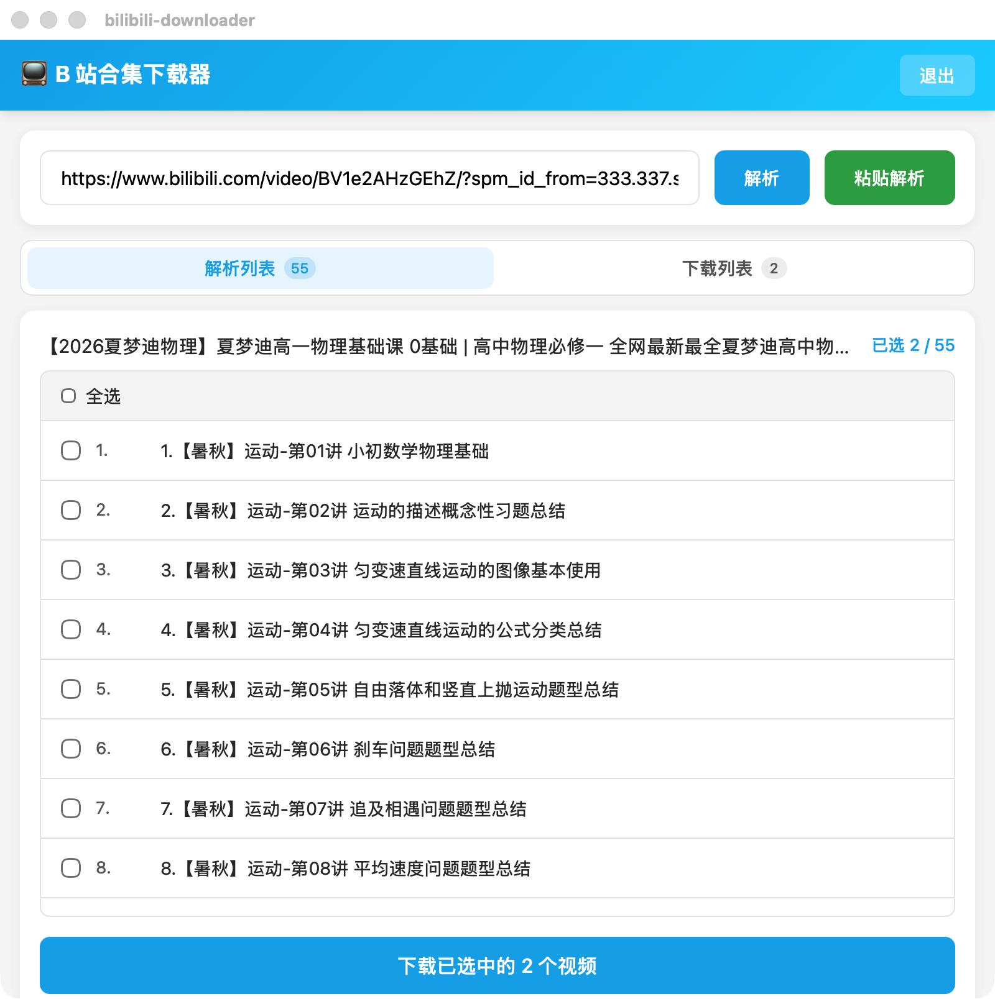
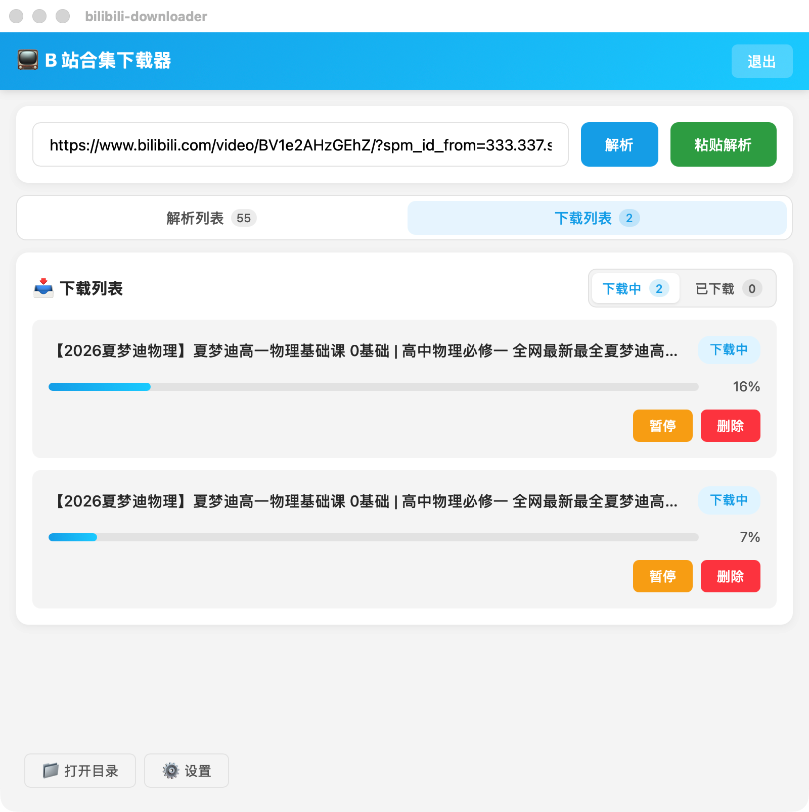

# DiliDown · 哔哩哔哩下载器

一个基于 **Tauri + React + Rust** 的桌面下载工具，目标是把 B 站视频解析、选集与下载流程做得稳定、可控、可维护。

## 产品目的

- 解决“下载流程不稳定、任务状态不可控、合集识别误判”的核心痛点。
- 提供面向日常使用的下载工作台：解析、选集、下载任务管理一体化。
- 在保持体验简洁的前提下，优先保证下载正确性与工程可维护性。

## 当前能力

- B 站扫码登录，登录态本地缓存（重启后可复用登录状态）。
- 视频 URL 解析，支持单视频、多分 P、合集场景识别。
- 解析列表与下载列表双主 Tab 视图，操作路径更清晰。
- 下载列表支持“下载中 / 已下载”子 Tab 管理。
- 已下载列表支持“清空列表”（仅清理任务记录，不删除本地视频文件）。
- 任务级控制：暂停、恢复、删除。
- 下载设置可配置：保存路径、并发连接数、视频质量、重试次数等。
- 一键脚本重启开发环境：自动检测并结束旧进程后重新启动。

## 软件截图

### 启动界面



### 下载列表



## 技术方向

### 1) 正确性优先

- 合集识别以结构化数据为主，默认使用严格模式（`strict`）。
- 判定顺序固定：多分 P -> `ugc_season` 当前 section -> 单视频回退。
- 避免高风险“全页链接扫描”导致的“扩到 UP 主全部视频”误判。

### 2) 稳定性优先

- 下载链路采用可观测的状态机：`Pending -> Downloading -> Paused -> Merging -> Completed/Failed`。
- 支持分块下载、失败重试、任务级暂停与恢复。
- 合并环节通过 FFmpeg，提升输出兼容性与可播放性。

### 3) 可维护性优先

- 前后端职责清晰：前端负责交互编排，后端负责网络与任务执行。
- 下载模块拆分为 `manager/chunked/merger`，便于定位与演进。
- 保持 Tauri command 接口稳定，降低前端改造成本。

## 技术栈

- 前端：React 19 + TypeScript + Vite
- 客户端框架：Tauri 2.x
- 后端：Rust + Tokio + Reqwest
- 音视频处理：FFmpeg（自动检测/安装，失败时回退系统 `ffmpeg`）

## 核心模块

- `src/App.tsx`：页面状态、解析流程、下载任务交互
- `src-tauri/src/commands.rs`：Tauri 命令入口（解析、下载、登录、配置）
- `src-tauri/src/bilibili.rs`：B 站接口访问与合集识别
- `src-tauri/src/login.rs`：扫码登录与登录态轮询
- `src-tauri/src/downloader/manager.rs`：任务生命周期与事件上报
- `src-tauri/src/downloader/chunked.rs`：分块下载与重试
- `src-tauri/src/downloader/merger.rs`：音视频合并

## 快速开始

### 环境要求

- Node.js 18+
- Rust stable（建议通过 `rustup` 安装）
- macOS / Windows / Linux（以本地 Tauri 运行环境为准）

### 安装依赖

```bash
npm install
```

### 启动开发环境

```bash
npm run tauri dev
```

或使用项目脚本（会先停止旧进程再重启）：

```bash
./scripts/restart-tauri-dev.sh
```

### 前端构建检查

```bash
npm run build
```

### macOS 一键打包 DMG

使用项目脚本一键构建 DMG：

```bash
./scripts/build-dmg.sh
```

构建完成后在 Finder 中定位产物：

```bash
./scripts/build-dmg.sh --open
```

说明：
- 该脚本内部执行 `npm run tauri build -- --bundles dmg`。
- 默认输出目录：`src-tauri/target/release/bundle/dmg/`。
- 脚本会在终端打印本次生成的 DMG 绝对路径。

### 一键清理构建过程文件

使用项目脚本清理构建产物（不删除依赖）：

```bash
./scripts/clean-build.sh
```

默认清理目录：
- `dist`
- `src-tauri/target`
- `src-tauri/gen`

说明：
- 仅清理构建过程文件，不会删除 `node_modules`。
- 脚本包含路径安全检查，避免误删项目外目录。

## 使用流程

1. 打开客户端，右上角扫码登录 B 站账号。
2. 在输入框粘贴视频 URL，点击“解析”或“粘贴解析”。
3. 在“解析列表”选择要下载的分 P/选集，点击下载。
4. 切换到“下载列表”查看任务状态，可暂停/恢复/删除。
5. 在“已下载”子 Tab 可清理任务记录，保持列表整洁。

## 配置说明

| 配置项 | 说明 | 默认值 |
| --- | --- | --- |
| `save_path` | 下载保存目录 | `~/Movies/DiliDown` |
| `concurrent_connections` | 并发连接数 | `4` |
| `chunk_size` | 分块大小 | `1MB` |
| `quality` | 视频清晰度（B站 qn） | `80`（1080P） |
| `max_retry` | 最大重试次数 | `3` |
| `timeout` | 单次请求超时（秒） | `30` |

## Roadmap

### 近期（v0.2）

- 前端开放合集识别模式切换（`strict / compat`）。
- 下载速度优化（并发策略、分块策略与网络重试参数调优）。
- 下载失败任务批量重试与错误归因增强。
- 下载列表增加更直观的速度/剩余时间展示。

### 中期（v0.3）

- 任务状态持久化（支持重启后恢复任务视图）。
- 下载历史检索与基本统计能力。
- 更完善的异常网络场景回退策略。

### 长期（v1.0+）

- 更完整的下载资产管理（视频、封面、元信息）。
- 批量任务体验优化（队列管理、规则化命名）。
- 面向长期维护的插件化能力探索。

## 已知边界

- 当前仅支持 B 站 `video/BV...` 视频链接解析。
- 任务执行状态当前以进程内为主，重启后不自动恢复下载过程。
- 受平台风控、会员权限、地区限制等因素影响，个别内容可能不可下载。

## 相关文档

- [下载系统设计](docs/download-system-design.md)
- [下载模块重构设计（2026-03-23）](docs/download-module-refactor.md)

## 免责声明

本项目仅用于学习与技术研究。请遵守 B 站服务条款及相关法律法规，仅下载你有权访问与使用的内容。
